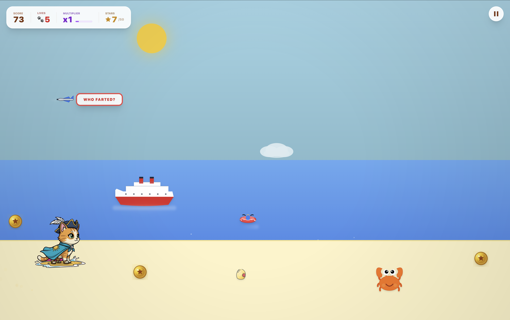

<div align="center">

# Beach Kitty

An AI-powered endless runner where a cat sprints along a beach, dodging crabs and seagulls, collecting coins, and battling a Sand Monster boss.

[Play Now](https://www.beachkittygame.games/)



</div>

---

## About

Beach Kitty is a browser-based endless runner built with React 19 and TypeScript. It combines hand-tuned platformer physics with Gemini AI integration that lets players generate custom cat sprites from text descriptions and receive AI-written in-game dialogue. AI requests are routed through server-side API endpoints so API keys are not exposed in the browser.

## Features

- **Double jump and duck** mechanics with squash-and-stretch animation
- **Boss fight** against the Sand Monster after collecting 50 stars
- **Power-ups** including speed boost, coin magnet, and super size with invincibility
- **AI cat customizer** that generates custom cat sprites from text prompts via Gemini AI
- **Procedural audio** using the Web Audio API with dynamic tempo that scales with game speed
- **Game feel** details: freeze frames on impact, screen shake, hit flash, speed lines, dust trails, floating score popups
- **Pattern-based obstacle spawning** that scales difficulty with score progress
- **Mobile support** with touch controls

## Tech Stack

| Layer | Technology |
|-------|-----------|
| Framework | React 19 |
| Language | TypeScript |
| Build | Vite |
| AI | Google Gemini via server-side API routes |
| Audio | Web Audio API (procedural synthesis) |
| Graphics | Canvas API (sprite processing), inline SVG (game objects) |
| Styling | Tailwind CSS |

The game loop runs on `requestAnimationFrame` with mutable refs for game state, avoiding React re-render overhead during gameplay. Collision detection uses axis-aligned bounding boxes with forgiving padding.

## Getting Started

```bash
git clone https://github.com/matthewod11-stack/CatRunner.git
cd CatRunner
npm install
npm run dev
```

To enable AI features (custom cat generation, in-game messages), create a `.env.local` file for local server execution:

```
GEMINI_API_KEY=your_api_key_here
```

In production, set `GEMINI_API_KEY` as a server environment variable on your hosting platform.

## Built With

Built using [Claude Code](https://claude.ai/code) and [Google Gemini](https://ai.google.dev/).

## License

This project is licensed under the MIT License. See [LICENSE](LICENSE) for details.
