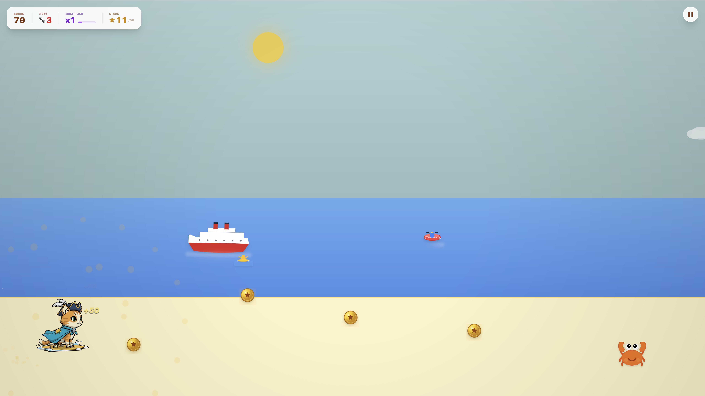
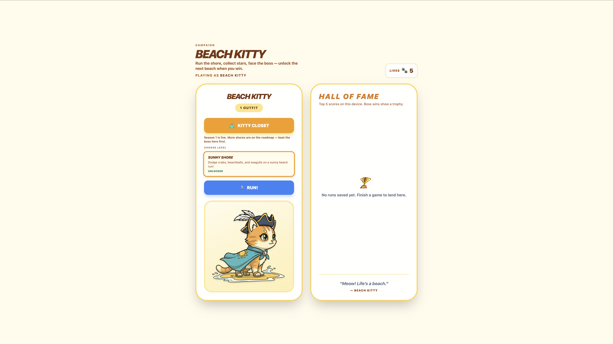
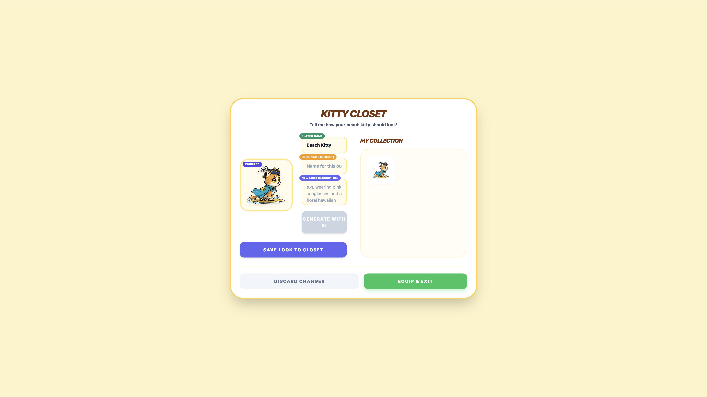

<div align="center">

# Beach Kitty

A browser game where a custom AI-generated cat plays through nine distinct game genres inside one Phaser-powered campaign.

[Play Now](https://www.beachkittygame.games/)



<table>
<tr>
<td></td>
<td></td>
</tr>
<tr>
<td align="center"><em>Main Menu</em></td>
<td align="center"><em>Kitty Closet — AI Cat Customizer</em></td>
</tr>
</table>

</div>

---

## About

Beach Kitty is a nine-level multi-genre Phaser campaign. The same custom cat moves from beach runner to platformer, launcher, shooter, breakout, frogger, whack, snake, and climber scenes while React owns the shell UI and Phaser owns gameplay.

The game runs entirely in the browser. Gemini API calls go through same-origin server routes so the key never touches the client.

## Project Status

- The active roadmap is `ROADMAP_V3.md`.
- The root session log is `PROGRESS.md`.
- Supporting documentation lives under `docs/`.
- `KNOWN_ISSUES.md` is retired; use GitHub Issues for bugs and debt.

## Features

- Nine playable campaign genres behind one shared cat identity
- Phaser scene runtime with lazy scene imports and React-owned campaign UI
- Boss fights, power-ups, custom cat generation, and Hall of Fame persistence
- Server-side Gemini image generation and sprite matting
- Procedural music, file-backed SFX, and runtime tuning tools
- IndexedDB-backed cat wardrobe and asset storage

## Tech Stack

| Layer | Technology |
|-------|-----------|
| Framework | React 19 |
| Language | TypeScript |
| Runtime | Phaser 3 |
| Build | Vite |
| AI | Google Gemini via server-side `/api/cat/*` routes |
| Image processing | sharp |
| Testing | Vitest |
| Hosting | Vercel |

## Getting Started

```bash
git clone https://github.com/matthewod11-stack/CatRunner.git
cd CatRunner
npm install
npm run dev
```

### AI features

Add a `.env.local` file with your Gemini API key:

```bash
GEMINI_API_KEY=your_key_here
```

The game still runs without it, but AI cat generation, wisdom quotes, and death messages will be unavailable.

## Controls

| Action | Keyboard | Touch |
|--------|----------|-------|
| Jump | Space / Up | Tap left half |
| Duck | Down | Tap right half |
| Double jump | Jump while airborne | Tap left half while airborne |
| Pause | P / Esc | — |

<details>
<summary><strong>Development</strong></summary>

### Commands

```bash
npm run dev
npm run build
npm run test:run
npm run preview
npx tsc --noEmit
./scripts/dev-init.sh
```

### Canonical Files

- `ROADMAP_V3.md` — active roadmap
- `PROGRESS.md` — root session log
- `docs/README.md` — docs index
- GitHub Issues — active bug and debt tracker

### Supporting Docs

- `docs/architecture/level-development.md`
- `docs/architecture/behavior-system.md`
- `docs/architecture/level-runtime.md`
- `docs/architecture/api-protection.md`
- `docs/product/qa-checklist.md`
- `docs/plans/README.md`
- `docs/specs/README.md`

Historical material lives under `docs/archive/`.

</details>

## Built With

Built with [Claude Code](https://claude.ai/code) and [Google Gemini](https://ai.google.dev/).

## License

MIT — see [LICENSE](LICENSE).
